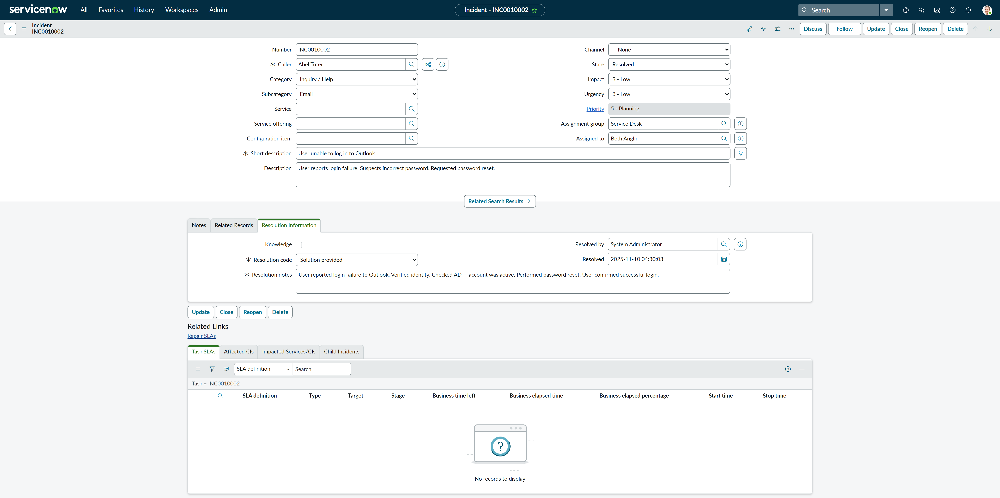

# 🛠️ ServiceNow IT Support Ticket Portfolio

This repository contains a set of realistic, simulated IT support tickets created using the ServiceNow developer instance (Classic UI). Each ticket reflects common incidents and service requests a Service Desk Analyst or IT Support Technician would handle in a real work environment.

This project demonstrates my understanding of ITSM practices, ServiceNow workflows, troubleshooting skills, and professional communication — all of which are essential for success in a support role.

---

## 📁 Ticket Scenarios

Each ticket includes full documentation in Markdown, realistic work/resolution notes, user-facing comments (where applicable), and annotated screenshots taken from ServiceNow.

| Ticket | Scenario | Description |
|--------|----------|-------------|
| [Ticket 1](./Ticket-1.md) | Password Reset | A standard request from a user who forgot their password. Temporary password provided and ticket documented. |
| [Ticket 2](./Ticket-2.md) | Printer Issue | User unable to print to a shared network printer. Issue resolved through troubleshooting and confirmation. |
| [Ticket 3](./Ticket-3.md) | New Starter Onboarding | Created a new user (Yusuf Khan), simulated full account setup, permissions, and communication with manager. |
| [Ticket 4](./Ticket-4.md) | Account Lockout | User account locked after failed login attempts. Simulated unlock and password reset with urgency. |

---

## 🖼️ Screenshots

Below are screenshots of each completed ticket taken from the ServiceNow Classic UI.

| Ticket | Screenshot |
|--------|------------|
| Ticket 1 |  |
| Ticket 2 |  |
| Ticket 3 |  |
| Ticket 4 |  |

> ⚠️ If images do not load, ensure the screenshot files are named exactly as shown above and located in the `/screenshots` folder.

---

## 🎯 Key Skills Demonstrated

- Proficient use of ServiceNow Classic UI
- Realistic IT ticket triage and documentation
- Writing internal Work Notes and customer-facing responses
- Simulating Active Directory tasks (password resets, account creation, group access)
- Following ITIL-style ticket handling from open to close

---

## 🧰 Tools Used

- ServiceNow Developer Instance (Classic UI)
- Markdown for documentation
- GitHub for version control and hosting
- Snipping Tool for screenshots

---

